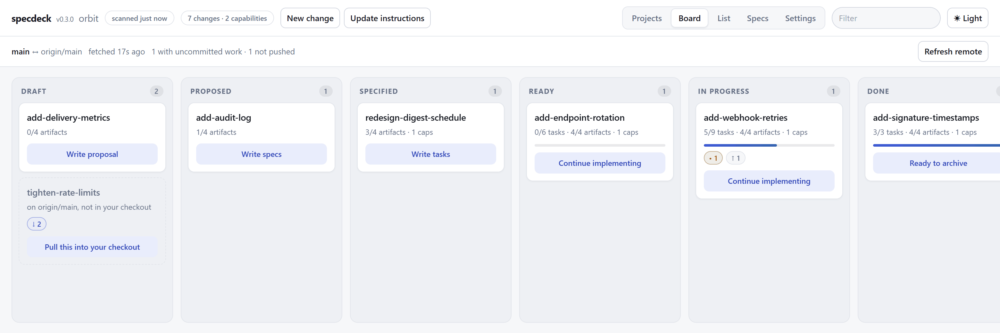
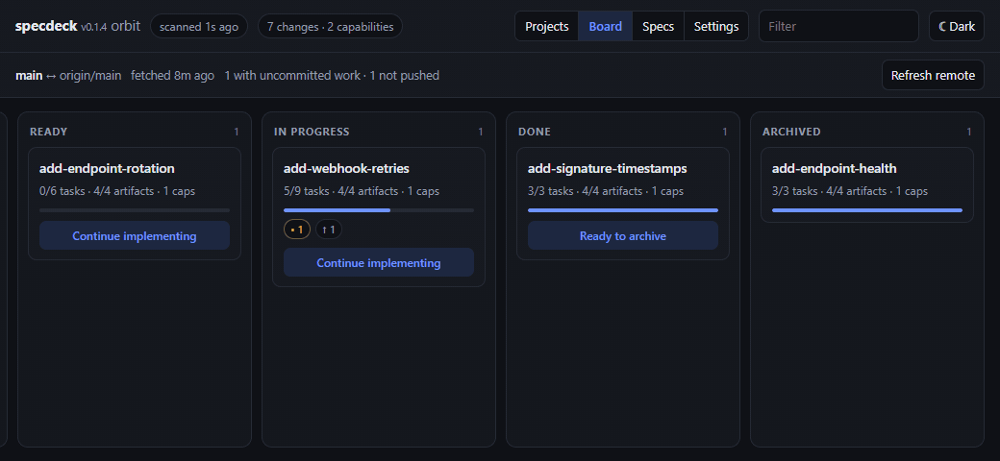
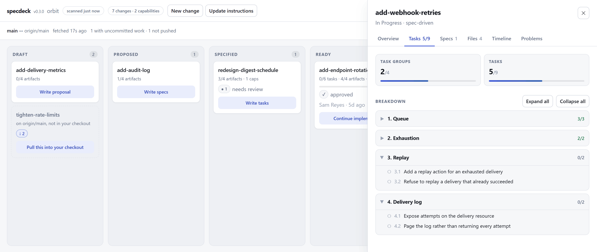
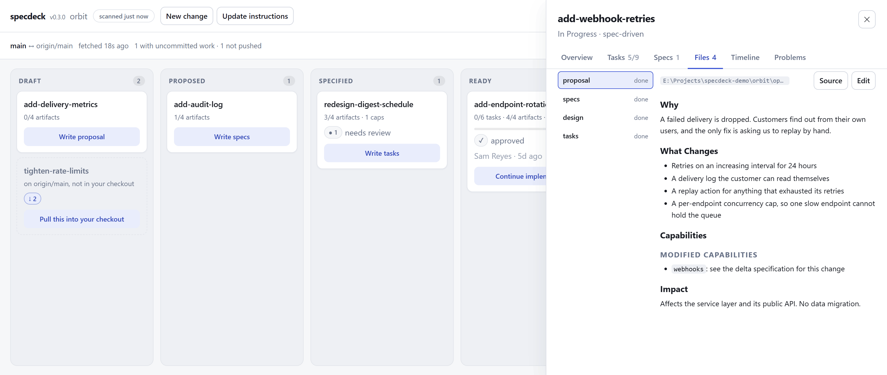
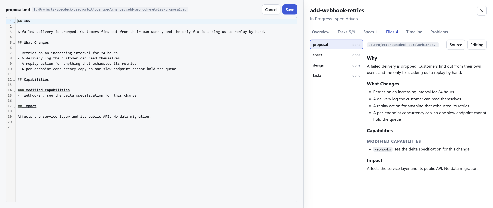
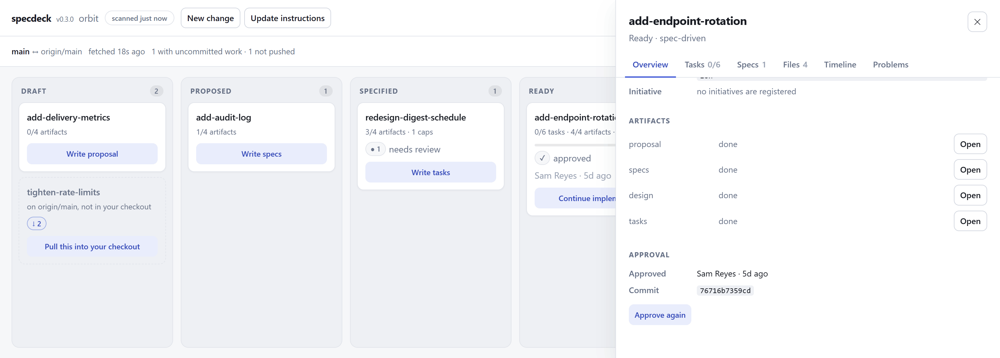
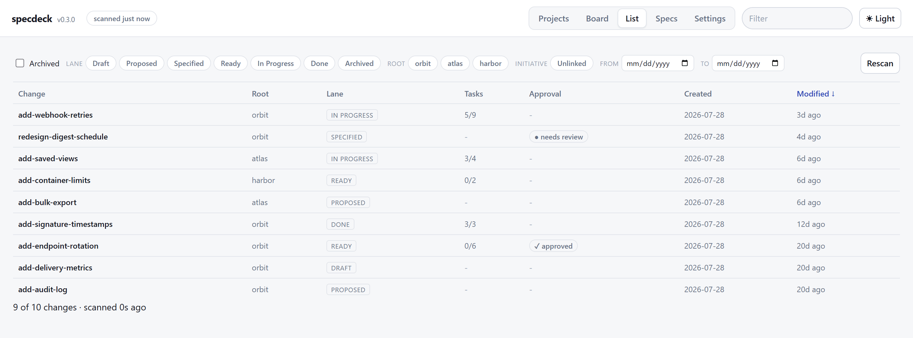
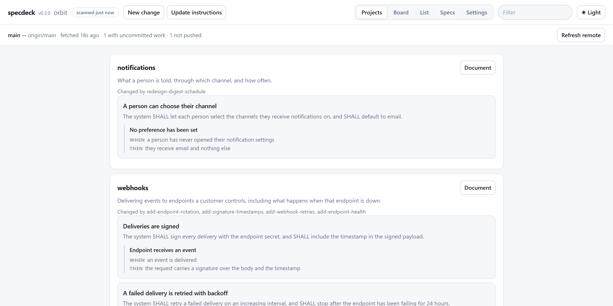
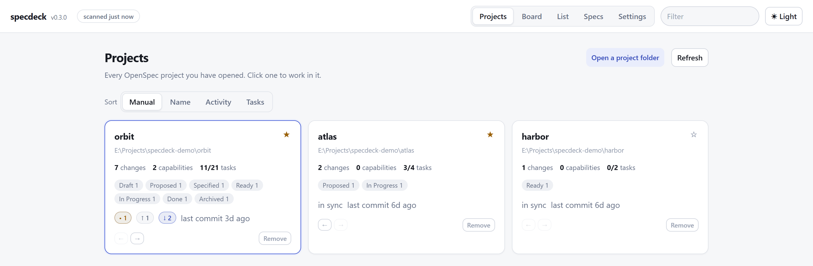
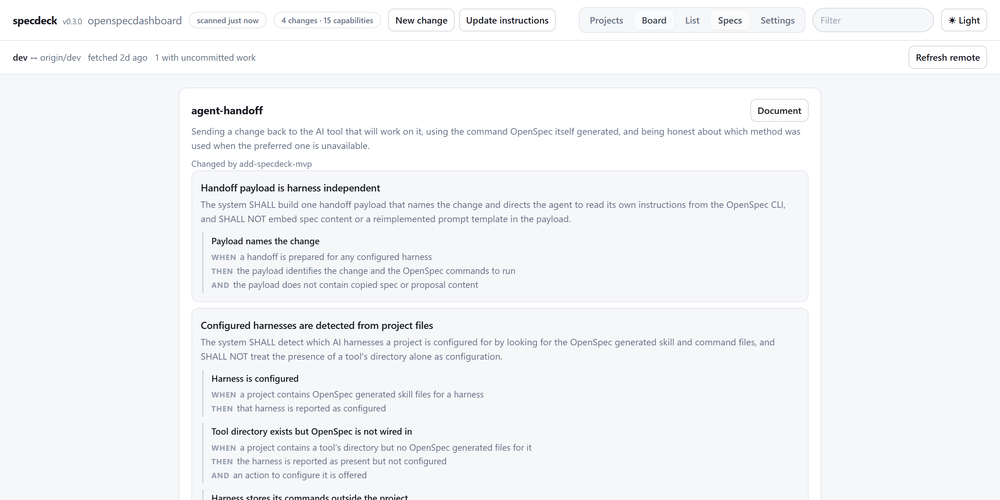

# specdeck

A local dashboard for [OpenSpec](https://github.com/Fission-AI/OpenSpec) projects.
specdeck reads your `openspec/` directory and your git history, then shows you what specs
exist, which changes are in flight, and what a teammate just pushed. You can read
artifacts, edit them, tick off tasks, and approve changes without leaving the browser.

It never calls a language model. Checking on your project is free.

<picture>
  <source media="(prefers-color-scheme: dark)" srcset="docs/media/board-dark.png">
  
</picture>

## Quick start

```bash
npx specdeck@latest
```

This starts a local server, opens your browser on the current folder, and uploads nothing
anywhere. Other ways to run it:

```bash
npx specdeck@latest ../some-other-project   # point it at a specific folder
npx specdeck@latest --port 4000 --no-open   # pick a port, skip the browser
npm i -g specdeck                           # or install it globally
```

Use `@latest` rather than a bare `npx specdeck`. npx caches by the exact text you type, so
without it you can get stuck on an old version.

**Requirements:** Node 20.19 or newer. git is optional; without it you lose sync state,
timelines, and approval, but everything else works.

> The screenshots on this page come from an invented demo project (a real project can't be
> put into every state worth showing), but the interface is real and unretouched.

## Features

### Live board

The board is a kanban view of your changes, and it updates as files change on disk. When
your agent ticks a task in `tasks.md`, the card moves. There is no status field to keep in
sync; lanes are derived from which artifacts exist and how many tasks are done.



### Remote awareness

The board reads git as well as the filesystem. A change that exists on the remote but not
in your checkout shows up as a greyed card you can pull, next to indicators for
uncommitted and unpushed work. Remote state comes from your last fetch, and the board
tells you how old that is.

### Tasks

<picture>
  <source media="(prefers-color-scheme: dark)" srcset="docs/media/change-tasks-dark.png">
  
</picture>

Tasks are grouped and counted, and finished groups collapse so long lists show what's
left instead of what's done. Ticking a checkbox writes back to `tasks.md`. If an agent
rewrote the file since the board last read it, the write is refused instead of clobbering
the agent's work.

### Reading and editing artifacts

<picture>
  <source media="(prefers-color-scheme: dark)" srcset="docs/media/change-files-dark.png">
  
</picture>

Every artifact your workflow schema declares (proposal, design, specs, tasks, or whatever
your own schema defines) is rendered as markdown, with the raw source one click away.
Capability specs read the same way.

Editing opens across the full page rather than in a narrow column, and saves go straight
to disk. If the file changed under you while you were typing, the save is refused, your
text is kept, and overwriting is an explicit button. `openspec validate` runs on save.

<picture>
  <source media="(prefers-color-scheme: dark)" srcset="docs/media/editor-dark.png">
  
</picture>

### Approval

<picture>
  <source media="(prefers-color-scheme: dark)" srcset="docs/media/approval-dark.png">
  
</picture>

Approving a change creates a commit with an `Approved-by:` trailer, scoped to that
change's directory (whatever else you had staged is left alone). Because the state lives
in git, it survives a clone and shows up for teammates when they pull. If any artifact is
edited afterwards, the change goes back to "needs review" and names the files that moved.

### List view

<picture>
  <source media="(prefers-color-scheme: dark)" srcset="docs/media/list-dark.png">
  
</picture>

All changes across every registered project in one table. Sort by name, lane, task
progress, approval, creation date, or last activity; filter by lane, root, initiative, or
date range. Archived changes are a toggle away.

### Specs view

<picture>
  <source media="(prefers-color-scheme: dark)" srcset="docs/media/specs-dark.png">
  
</picture>

Requirements and scenarios parsed and shown in full, with each capability listing the
changes currently modifying it.

### Projects view

<picture>
  <source media="(prefers-color-scheme: dark)" srcset="docs/media/projects-dark.png">
  
</picture>

Every project you've opened, with lane breakdown, task totals, sync state, and last
commit. Star projects, drag them into an order you like, or sort by name, activity, or
remaining work. OpenSpec's workspaces and context stores appear here too, with health
from `openspec workspace doctor` and `openspec context-store doctor`.

### OpenSpec commands

Create a change, validate one, refresh instruction files, link an initiative, archive.
Each button runs the real `openspec` command, and when one fails you see the command, the
exit status, and its output.

### Handoff to your agent

specdeck detects which AI tools your project has OpenSpec wired into and hands work off
using the command OpenSpec generated. Depending on the tool it can open a terminal, open
an existing session, or copy the prompt, and it tells you which one it did.

### Setup for new projects

Point specdeck at a folder with no `openspec/` directory and it offers to run
`openspec init`, with a tool picker and the exact command displayed next to the button in
case you'd rather run it yourself.

## Design principles

These explain most of the product's behavior:

- **Everything is derived, nothing is stored.** No status field, no progress database, no
  sidecar files. If the board says a change is in progress, that's because its tasks file
  says so. Approval state is recomputed from git every time. Edit files outside specdeck
  and the board just agrees with you.
- **specdeck writes only what you asked it to, only where OpenSpec already writes.** The
  only files it writes in your repository are OpenSpec artifacts at paths OpenSpec owns.
  Its own configuration and registry live in `~/.specdeck/`. It never creates a commit
  you didn't ask for (approving commits only that change's directory and never bypasses a
  hook), and reading a project writes nothing at all. There are tests for each of these.
- **It never claims to know more than it does.** Local state is live; remote state is a
  snapshot from your last fetch, labeled with its age. Dates reconstructed from git are
  marked approximate. When a check can't run, nothing is shown rather than a reassuring
  default.
- **Failures are readable.** When something fails you get the command, the exit status,
  and the real output. A commit hook that rejects an approval is reported, never bypassed.

## What it won't do

- Move a card between lanes by drag. Lanes come from your files, so a drag would be
  undone on the next read. Archiving is the one drag that exists, because it's a real
  action.
- Reject a change, thread review conversations, or track reviewers. Approval is one bit
  derived from git; discussion belongs in a forge.
- Merge conflicting edits. A save whose base has moved is refused, and overwriting is an
  explicit choice.
- Register, modify, or remove OpenSpec's workspaces and context stores. It reads them;
  OpenSpec owns them.
- Pull anything but a fast-forward. If both your branch and the remote have moved,
  specdeck stops and says so instead of creating a merge commit.
- Browse repositories you haven't cloned.
- Call a language model.

## Supported AI tools

Detected from the files `openspec init` generates: Claude Code, Cursor, Windsurf,
opencode, Gemini CLI, GitHub Copilot, Kilo Code, and Roo Code.

Codex keeps its commands in your home folder rather than the project, so there is nothing
in the repository to detect; specdeck reports it as undetectable rather than absent.

Other tools still work. Handoff falls back to copying the prompt, which works everywhere.

A CI job initializes every supported tool in a throwaway directory and fails if OpenSpec
starts generating files somewhere specdeck doesn't expect.

These are other people's product names, used only to say what specdeck works with. No
affiliation or endorsement is implied.

## Known limitations

- Approval needs git, an initial commit, a configured `user.name` and `user.email`, and a
  branch. Each missing piece is refused with the specific reason and, where possible, the
  command that fixes it.
- Approval is one trailer in one commit. Anyone who can commit can write one, so it
  records agreement rather than enforcing it. For enforcement, use branch protection on
  your forge.
- `Update instruction files` runs `openspec update`, which also rewrites OpenSpec's
  global configuration. It sits behind a confirmation for that reason and never runs as
  part of reading a project.
- Handoff can only open a terminal or agent session for tools it knows how to start;
  anything else falls back to copying the prompt, and the UI says which method was used.
- Attaching to a session opens it with the prompt on your clipboard. There's no reliable
  way to push a message into a running conversation, so specdeck doesn't pretend to.
- Timelines need git. Without a repository, dates fall back to file modification times,
  which don't survive a clone, and are labeled approximate.
- The served page is around 750kb, most of which is the editor. Fine over loopback, but
  no longer tiny.
- specdeck is young. It's used daily on this repository and tested on Linux, macOS, and
  Windows, but it hasn't been through many hands yet.

## Contributing

```bash
git clone https://github.com/AidanFeess/specdeck.git
cd specdeck
npm install
npm run verify
```

`npm run verify` runs formatting, linting, type checking, and tests, the same things CI
runs on Linux, macOS, and Windows against Node 20.19 and Node 24.

specdeck is built with OpenSpec and tracks its own development with it. These are its own
specs, read out of this repository by specdeck:

<picture>
  <source media="(prefers-color-scheme: dark)" srcset="docs/media/self-specs-dark.png">
  
</picture>

`openspec/specs/` describes what the software should do, and `openspec/changes/` holds
what's being changed about it. The design document of a change records the decisions made
and the alternatives rejected, which is the fastest way into the codebase.

See [CONTRIBUTING.md](CONTRIBUTING.md) for the branch model, the client build step, and
the release process.

The screenshots in this README are generated by `scripts/capture/`, which builds demo
projects and drives a headless browser, so they can be regenerated after UI changes
instead of going stale.

## License

MIT. See [LICENSE](LICENSE).
